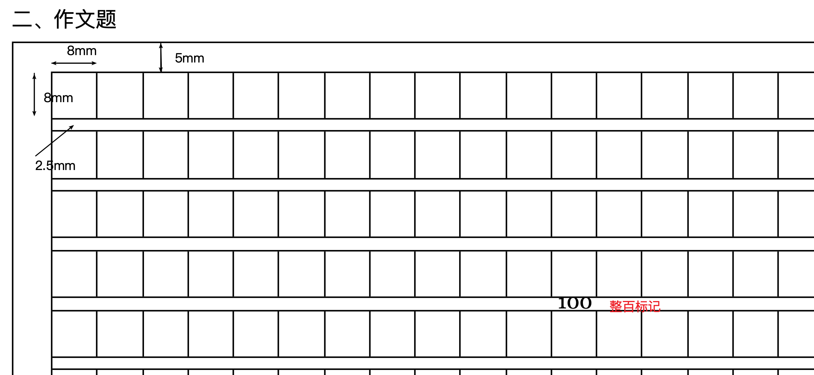

# 答题卡的在线生成器

```shell
cd answer-card
yarn
yarn start

# test
yarn run test

# build
yarn run build
```

## 想实现的功能：
1. 支持多种标准纸型如A4/A3/B5，最后会支持自定义纸张尺寸；
2. 支持考号区域的手填和贴码两种方式；
3. 支持选择题，包括分组、自定义选项功能；
4. 支持填空题，包括自定义高度、自定义多行一题功能；
5. 支持解答题，包括自定义高度、插入富文本功能；
6. ~~支持中文方格作文题~~；
7. 支持英文横线作文题；

## 设计标准


paper type|actual width|actual height|content width|content height
----------|------------|-------------|-------------|--------------
A4        |210mm       |297mm        |190mm        |277mm

说明：
- 标准纸型的实现物理尺寸是确实的，比如A4纸张是21mmx297mm，实际使用的内容区域是物理尺寸每边向内缩进了10mm，则计算出A4纸的内容区域是190mmx277mm；
- 同时为扫描端提供了左上、右上、左下3个定位点，每个定位点的尺寸是5mmx5mm，则扫描切图的尺寸是200mmx287mm；
- 所有尺寸标注的原点为TODO:待定，理论上使用纸张的左上角或者左上角定位点都可以，后续需要看哪个计算方便（使用纸纸左上角时，扫描后需要进行转换）；
- 所有尺寸的标注为4个值：x、y、w、h分别代表了距原点的偏移值和自身的宽高；

### 标题

- 标题的高度一致为8mm并且不换行（理论上大题说明一行搞定）；
- 标题涉及到分页时，一律放到下页；
<br />

[代码路径](https://github.com/Joo-fanChang/answer-card/blob/0.0.1/src/tools/QuestionClasses/TitleClass.ts#L18)

```typescript
public splitSelf(currentPage: PageClass) {
  const nextQuestion = this;
  return {
    currentPage,
    nextQuestion,
  }
}
```

### 解答题

- 宽度为纸型栏位的宽度，高度可以设置和自由调整；
- 涉及分页时，依次递减上页可以高度；
<br />

[代码路径](https://github.com/Joo-fanChang/answer-card/blob/0.0.1/src/tools/QuestionClasses/AnswerQuestionClass.ts#L21)

```typescript
public splitSelf(currentPage: PageClass) {
  const delta = this.requiredHeight - currentPage.availableHeight;
  this.requiredHeight = currentPage.availableHeight;
  let nextQuestion = null;

  if (delta >= 10) { // 下页不足10mm时，省略掉
    nextQuestion = new AnswerQuestionClass(this.question, delta);
    nextQuestion.partNo = this.partNo + 1;
  }
  currentPage.components.push(this);
  return {
    currentPage,
    nextQuestion,
  }
}
```

### 中文作文题

- 中文方格标准为8mmx8mm，两行之间间隔为2.5mm，最后一行不带间隔；
- 每逢整百有标记；
- 分页时剩余格子数 = 总格子数 - 上页容纳格子数；
<br />

[代码路径](https://github.com/Joo-fanChang/answer-card/blob/0.0.1/src/tools/QuestionClasses/EssayQuestionClass.ts#L37)

```typescript
public splitSelf(currentPage: PageClass) {
  this.rows = Math.floor((currentPage.availableHeight - 10) / (8 + 2.5));
  const restLength = this.restLength - this.rows * this.lenPerRow;
  const nextQuestion = new EssayQuestionClass(this.question, this.paperType, restLength);
  nextQuestion.partNo = this.partNo + 1;
  nextQuestion.prevRows = this.prevRows + this.rows;
  currentPage.components.push(this);
  return {
    currentPage,
    nextQuestion,
  }
}
```

### 选择题
```typescript
public splitSelf(currentPage: PageClass) {
  const { contentHeight, availableHeight } = currentPage;
  let splitIdx = 0;
  let totalHeight = 0;

  for(let i = 0; i < this.groupRows.length; i++) {
    totalHeight += this.groupRows[i].height;
    if (totalHeight > availableHeight) {
      splitIdx = i;
      break;
    }
  }

  const currentGroupRows = this.groupRows.slice(0, splitIdx);
  const nextGroupRows = this.groupRows.slice(splitIdx);
  this.groupRows = currentGroupRows;
  this.offsetY = contentHeight - availableHeight;
  currentPage.addComponents(this);
  const nextQuestion = new ChoiceQuestionCLass(this.question, this.paperType, nextGroupRows);
  return {
    currentPage,
    nextQuestion,
  }
}
```